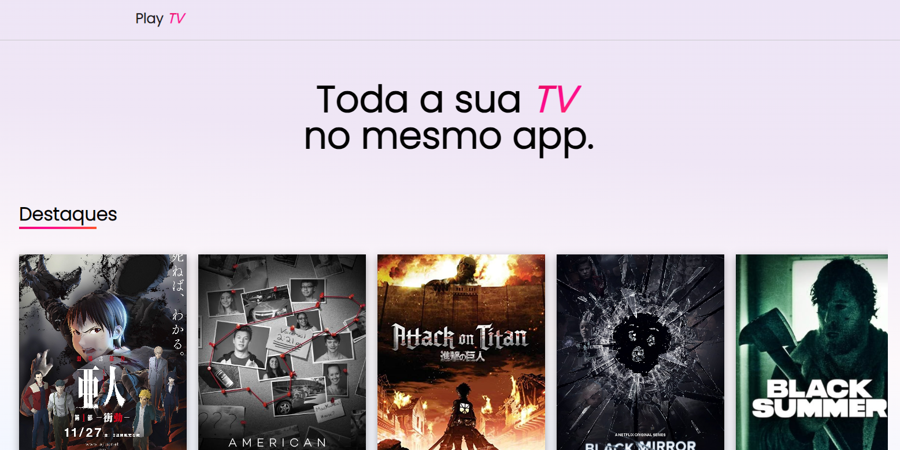

# Play TV 📺


You can access it with this [link.]()

# 💻 About the project

This project offers users the opportunity to explore different platforms such as Prime Video, Netflix, HBO and others, while browsing a diverse selection of movies and music. A distinctive feature is the ability to click and enter the entertainment journey, creating an immersive user experience through a transition to the login page.

# 🚀 Technologies

Play TV was developed using the following technologies:

- CSS-in-JS
- React.js
- JavaScript
- Vercel (hosting platform)

# 🛠️ How to install the project on your machine

To install and run the project, follow the steps below:

<h3>Before you begin, make sure you have the following tools installed on your system:</h3>

- Node.js (version 14 or higher)
- NPM (Node Package Manager) ou Yarn

<h3>Step 1: Clone the repository</h3>

- Clone this repository to your local environment:

```bash
git clone https://github.com/devpdro/tv-project.git
```

<h3>Step 2: Install dependencies</h3>

- Navigate to the project directory:

```bash
cd tv-project
```

- Install the project's dependencies:

```bash
npm install
```

<h3>Step 3: Run the project</h3>

- Start the development server:

```bash
npm start
```

- This will start the local server and provide a URL to view the project in your browser.

```bash
Local: http://localhost:3000
```